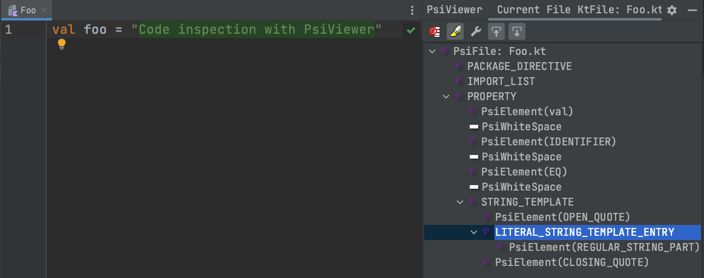

!!! Tip
    See [Writing your first ktlint rule](https://medium.com/@vanniktech/writing-your-first-ktlint-rule-5a1707f4ca5b) by [Niklas Baudy](https://github.com/vanniktech).

In a nutshell: a "rule set" is a JAR containing one or more [Rule](https://github.com/pinterest/ktlint/blob/master/ktlint-rule-engine-core/src/main/kotlin/com/pinterest/ktlint/rule/engine/core/api/Rule.kt)s. `ktlint` is relying on the [ServiceLoader](https://docs.oracle.com/javase/8/docs/api/java/util/ServiceLoader.html) to discover all available "RuleSet"s on the classpath. As a ruleset author, all you need to do is to include a `META-INF/services/RuleSetProviderV3` file containing a fully qualified name of your [RuleSetProviderV3](https://github.com/pinterest/ktlint/blob/master/ktlint-cli-core/src/main/kotlin/com/pinterest/ktlint/ruleset/core/api/RuleSetProviderV3.kt) implementation.

## ktlint-ruleset-template

A complete sample project (with tests and build files) is included in this repo under the [ktlint-ruleset-template](https://github.com/pinterest/ktlint/tree/master/ktlint-ruleset-template) directory (make sure to check [NoVarRuleTest](https://github.com/pinterest/ktlint/blob/master/ktlint-ruleset-template/src/test/kotlin/yourpkgname/NoVarRuleTest.kt) as it contains some useful information).

```shell title="Building the ktlint-ruleset-template"
$ cd ktlint-ruleset-template/
$ ../gradlew build
```

```shell title="Provide code sample that violates rule `custom:no-var"
$ echo 'var v = 0' > test.kt
```

```shell title="Running the ktlint-ruleset-template" hl_lines="1 40 43"
$ ktlint -R build/libs/ktlint-ruleset-template.jar --log-level=debug --relative test.kt

18:13:21.026 [main] DEBUG com.pinterest.ktlint.internal.RuleSetsLoader - JAR ruleset provided with path "/../ktlint/ktlint-ruleset-template/build/libs/ktlint-ruleset-template.jar"
18:13:21.241 [main] DEBUG com.pinterest.ktlint.Main - Discovered reporter with "baseline" id.
18:13:21.241 [main] DEBUG com.pinterest.ktlint.Main - Discovered reporter with "checkstyle" id.
18:13:21.241 [main] DEBUG com.pinterest.ktlint.Main - Discovered reporter with "json" id.
18:13:21.242 [main] DEBUG com.pinterest.ktlint.Main - Discovered reporter with "html" id.
18:13:21.242 [main] DEBUG com.pinterest.ktlint.Main - Discovered reporter with "plain" id.
18:13:21.242 [main] DEBUG com.pinterest.ktlint.Main - Discovered reporter with "sarif" id.
18:13:21.242 [main] DEBUG com.pinterest.ktlint.Main - Initializing "plain" reporter with {verbose=false, color=false, color_name=DARK_GRAY}
[DEBUG] Rule with id 'standard:max-line-length' should run after the rule with id 'trailing-comma'. However, the latter rule is not loaded and is allowed to be ignored. For best results, it is advised load the rule.
[DEBUG] Rules will be executed in order below (unless disabled):
           - standard:filename, 
           - standard:final-newline, 
           - standard:chain-wrapping, 
           - standard:colon-spacing, 
           - standard:comma-spacing, 
           - standard:comment-spacing, 
           - standard:curly-spacing, 
           - standard:dot-spacing, 
           - standard:import-ordering, 
           - standard:keyword-spacing, 
           - standard:modifier-order, 
           - standard:no-blank-line-before-rbrace, 
           - standard:no-consecutive-blank-lines, 
           - standard:no-empty-class-body, 
           - standard:no-line-break-after-else, 
           - standard:no-line-break-before-assignment, 
           - standard:no-multi-spaces, 
           - standard:no-semi, 
           - standard:no-trailing-spaces, 
           - standard:no-unit-return, 
           - standard:no-unused-imports, 
           - standard:no-wildcard-imports, 
           - standard:op-spacing, 
           - standard:parameter-list-wrapping, 
           - standard:paren-spacing, 
           - standard:range-spacing, 
           - standard:string-template, 
           - custom:no-var, 
           - standard:indent, 
           - standard:max-line-length
`text test.kt:1:1: Unexpected var, use val instead (cannot be auto-corrected)`
18:13:21.893 [main] DEBUG com.pinterest.ktlint.Main - 872ms / 1 file(s) / 1 error(s)
```

!!! tip
    Multiple custom rule sets can be loaded at the same time.

## Abstract Syntax Tree (AST)

While writing/debugging [Rule](https://github.com/pinterest/ktlint/blob/master/ktlint-rule-engine-core/src/main/kotlin/com/pinterest/ktlint/ruleset/core/api/Rule.kt)s it's often helpful to inspect the Abstract Syntax Tree (AST) of the code snippet that is to be linted / formatted. The [Jetbrain PsiViewer plugin for IntelliJ IDEA](https://github.com/JetBrains/psiviewer) is a convenient tool to inspect code as shown below:


