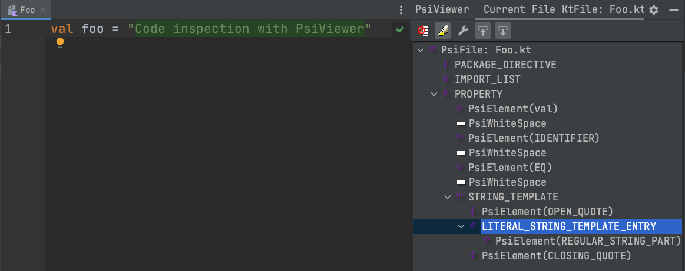

You can provide custom rules via a separate ruleset to Ktlint. A ruleset is a JAR containing one or more [Rule](https://github.com/pinterest/ktlint/blob/master/ktlint-rule-engine-core/src/main/kotlin/com/pinterest/ktlint/rule/engine/core/api/Rule.kt)s.

A complete sample project is included in this repo under the [ktlint-ruleset-template](https://github.com/pinterest/ktlint/tree/master/ktlint-ruleset-template) directory. This directory can be cloned, and used as a starting point for a new project containing your custom ruleset.

## ktlint-ruleset-template

### Gradle build

The [Gradle build file](https://github.com/pinterest/ktlint/blob/master/ktlint-ruleset-template/build.gradle.kts) of the sample project includes the setup for:

* publishing the custom ruleset artifact to Maven
* the custom Gradle task 'ktlintCheck' that is using the Ktlint CLI to run the rules provided by the ktlint project, as well as the custom rule(s) from this project on the project itself ([dogfood principle](https://en.wikipedia.org/wiki/Eating_your_own_dog_food)).

### Rule

The Rule contains the logic for linting and formatting the code. For example, see [NoVarRuleTest](https://github.com/pinterest/ktlint/blob/master/ktlint-ruleset-template/src/main/kotlin/yourpkgname/NoVarRule.kt).

A rule has to implement one or more of hooks below:

* `Rule.beforeFirstNode`
* `RuleAutocorrectApproveHandler.beforeVisitChildNodes`
* `RuleAutocorrectApproveHandler.afterVisitChildNodes`
* `Rule.afterLastNode`

!!! Tip
See `ktlint-ruleset-standard` for examples of rules that implement the hooks above.

Upon traversal of the Abstract Syntax Tree (AST), the hooks of the Rule are visited as indicated by their names. The [Jetbrains PsiViewer plugin for IntelliJ IDEA](https://plugins.jetbrains.com/plugin/227-psiviewer) is a convenient tool to inspect the AST for any piece of code.



### Rule Set Provider

The RuleSetProvider provides new instances of the rule, see [CustomRuleSetProvider](https://github.com/pinterest/ktlint/blob/master/ktlint-ruleset-template/src/main/kotlin/yourpkgname/CustomRuleSetProvider.kt) for an example.

`ktlint` is relying on the [ServiceLoader](https://docs.oracle.com/javase/8/docs/api/java/util/ServiceLoader.html) to discover all available "RuleSet"s on the classpath. For this, the RuleSetProvider needs to be registered in file `resources/META-INF/services/com.pinterest.ktlint.cli.ruleset.core.api.RuleSetProviderV3`, see [Registration for Java ServiceLoader](https://github.com/pinterest/ktlint/blob/master/ktlint-ruleset-template/src/main/resources/META-INF/services/com.pinterest.ktlint.cli.ruleset.core.api.RuleSetProviderV3).

### Building the project

```shell title="Building the ktlint-ruleset-template"
$ cd ktlint-ruleset-template/
$ ../gradlew build
```

### Running Ktlint CLI with the custom ruleset

```shell title="Provide code sample that violates rule `custom:no-var"
$ echo 'var v = 0' > test.kt
```

```shell title="Running the ktlint-ruleset-template" hl_lines="1 40 43"
$ ktlint -R build/libs/ktlint-ruleset-template.jar --log-level=debug --relative test.kt

18:13:21.026 [main] DEBUG com.pinterest.ktlint.internal.RuleSetsLoader - JAR ruleset provided with path "/../ktlint/ktlint-ruleset-template/build/libs/ktlint-ruleset-template.jar"
18:13:21.241 [main] DEBUG com.pinterest.ktlint.Main - Discovered reporter with "baseline" id.
18:13:21.241 [main] DEBUG com.pinterest.ktlint.Main - Discovered reporter with "checkstyle" id.
18:13:21.241 [main] DEBUG com.pinterest.ktlint.Main - Discovered reporter with "json" id.
18:13:21.242 [main] DEBUG com.pinterest.ktlint.Main - Discovered reporter with "html" id.
18:13:21.242 [main] DEBUG com.pinterest.ktlint.Main - Discovered reporter with "plain" id.
18:13:21.242 [main] DEBUG com.pinterest.ktlint.Main - Discovered reporter with "sarif" id.
18:13:21.242 [main] DEBUG com.pinterest.ktlint.Main - Initializing "plain" reporter with {verbose=false, color=false, color_name=DARK_GRAY}
[DEBUG] Rule with id 'standard:max-line-length' should run after the rule with id 'trailing-comma'. However, the latter rule is not loaded and is allowed to be ignored. For best results, it is advised load the rule.
[DEBUG] Rules will be executed in order below (unless disabled):
           - standard:filename, 
           - standard:final-newline, 
           - standard:chain-wrapping, 
           - standard:colon-spacing, 
           - standard:comma-spacing, 
           - standard:comment-spacing, 
           - standard:curly-spacing, 
           - standard:dot-spacing, 
           - standard:import-ordering, 
           - standard:keyword-spacing, 
           - standard:modifier-order, 
           - standard:no-blank-line-before-rbrace, 
           - standard:no-consecutive-blank-lines, 
           - standard:no-empty-class-body, 
           - standard:no-line-break-after-else, 
           - standard:no-line-break-before-assignment, 
           - standard:no-multi-spaces, 
           - standard:no-semi, 
           - standard:no-trailing-spaces, 
           - standard:no-unit-return, 
           - standard:no-unused-imports, 
           - standard:no-wildcard-imports, 
           - standard:op-spacing, 
           - standard:parameter-list-wrapping, 
           - standard:paren-spacing, 
           - standard:range-spacing, 
           - standard:string-template, 
           - custom:no-var, 
           - standard:indent, 
           - standard:max-line-length
`text test.kt:1:1: Unexpected var, use val instead (cannot be auto-corrected)`
18:13:21.893 [main] DEBUG com.pinterest.ktlint.Main - 872ms / 1 file(s) / 1 error(s)
```

!!! tip
Multiple custom rule sets can be loaded at the same time.
