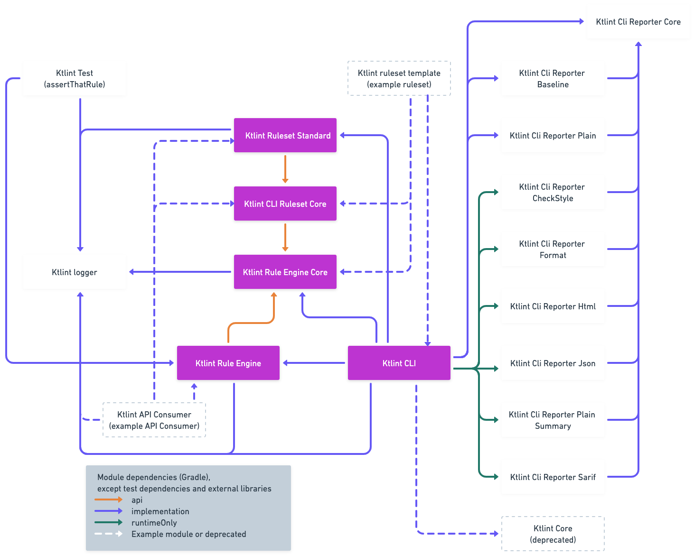

Ktlint has an open API with which you can integrate. 

The diagram below show the internal module structure of KtLint.

The `Ktlint Rule Engine` is by far the most important module. It is responsible for executing the linting and formatting of the source code. The Rule Engine itself does not contain any rules. Rules are provided by API Consumers.

The `Ktlint CLI` is an API Consumer of the `Ktlint Rule Engine`. Together with the `Ktlint Ruleset Standard` and the `Ktlint Reporter` modules the CLI offers a standalone tool which can easily be run from the commandline. Also, the `Ktlint CLI` can easily be used with custom rulesets and/or reporters.

The `Ktlint Ruleset Core` module contains the logic which is required by each API Consumer of the `Ktlint Rule Engine`, the `Ktlint Ruleset Standard` and custom rulesets. 

The module `Ktlint Test` provide functionalities like `assertThatRule` which is used to write unit tests in a fluent AssertJ look-a-like style and can also be used for testing of custom rules.

The `Ktlint logger` module provides functionality for writing log messages. 

