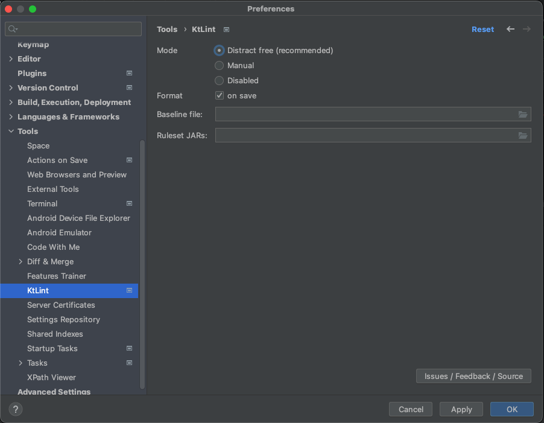
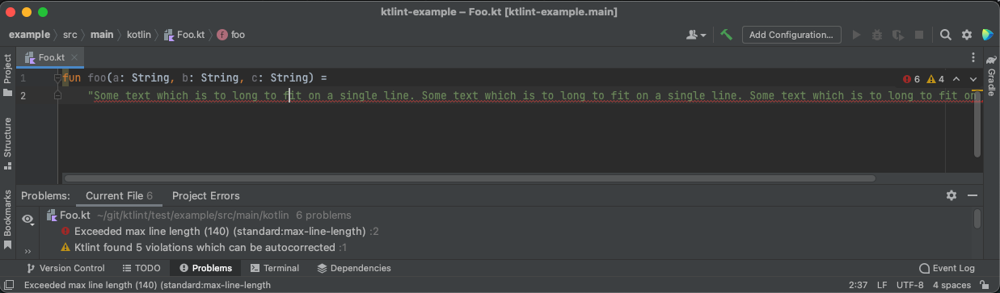
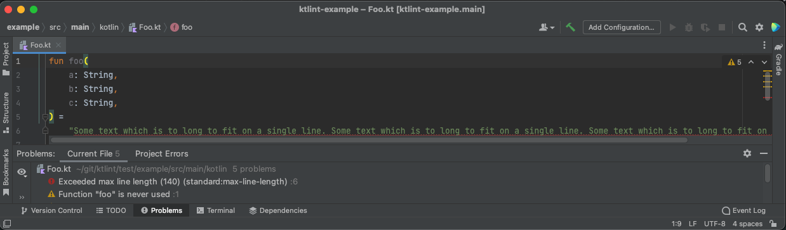
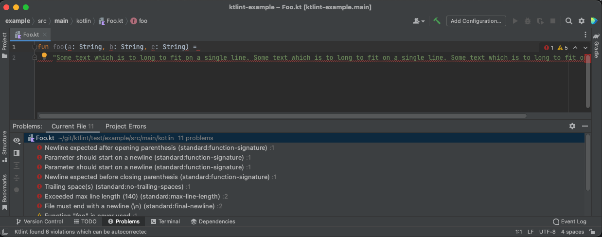
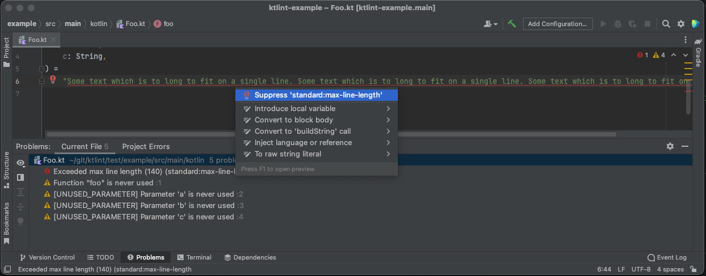

# Recommended setup

Ktlint can be installed in a lot of different ways. It depends on your situation what works best for you.

As maintainer of Ktlint, I advise setup below to maximize your productivity, and get feedback early according to the failing fast principle.

1. `ktlint-intellij-plugin` for direct feedback while coding
2. Git pre-commit hook for feedback when committing
3. Build pipeline as last defence

## `ktlint-intellij-plugin` for direct feedback while coding

!!! tip
    Ensure to install version `0.20.0` (or later) of the Ktlint plugin via the Intellij Plugin Marketplace to get benefits described below.

The `ktlint-intellij-plugin` gives direct feedback while writing code. The plugin can be used in 'distract free' and 'manual' mode, or be disabled entirely. This is a per-project setting.

In `distract free` mode, the plugin only shows the violations which need to be manually corrected. Ktlint formatting will be applied automatically after apply Intellij IDEA format, or on save of the file. This works bests for projects for which the `.editorconfig` already has been set up properly for the project.

Note that image above also shows a warning that 'Ktlint found 5 violations which can be autocorrected'. Reformatting the file, or simply save the file, results in:

In 'manual' mode, or in 'distract free' mode after selecting 'Show all Ktlint violations in file', each individual violation is shown as error. This allows for suppressing errors that can be autocorrected, but for which this is unwanted.

Violations reported by ktlint can be suppressed by adding a `@Suppress` annotation via the quick fix:

As of Ktlint `1.1.0` the maintainer of Ktlint has joined the [ktlint-intellij-plugin project](https://github.com/nbadal/ktlint-intellij-plugin) to ensure that the plugin stays up to date with releases of ktlint and releases of Intellij IDEA.

The `ktlint-intellij-plugin` can be installed as [plugin in Intellij IDEA](https://plugins.jetbrains.com/plugin/15057-ktlint-unofficial-).

## Git pre-commit hook for feedback when committing

The [git pre-commit hook](cli.md#git-hooks), protects against committing code containing lint violations. From the perspective of code reviewing it is important that the code is already formatted in the style of the project. This is especially valuable after refactorings (for example search and replace) have been applied on files that are not opened in the editor and as of that might not have been updated by the `ktlint-intellij-plugin`.

Ktlint CLI can generate a pre-commit hook, or you can find it [here](https://github.com/pinterest/ktlint/blob/master/ktlint-cli/src/main/kotlin/com/pinterest/ktlint/cli/internal/GitPreCommitHookSubCommand.kt#L23).

## Build pipeline as last defence

As last defence, to ensure that the code base does not contain lint violations, `ktlint-cli` is run in the (local and remote) build pipeline (see [integrations](integrations.md)). 

For example, in my maven projects I have bound the [ktlint (linting) task](integrations.md#maven-integration) to the maven `compile` lifecycle. If after compile a lint violation is found the build is failed. This circumvents that developers disable running of the git hooks on their local machine. And in case that the code was not build locally, the remote build pipeline fails as last resort.
